# Generative AI Usage Analysis

This project analyzes the usage patterns and emotional content in chat interactions with generative AI, focusing on the relationship between exam periods, time of day, and emotional expressions in the conversations.

## Hypothesis
Exam periods and certain hours of the day have a significant relationship with the emotional content of chat interactions.

## Analysis and Visualizations

### 1. General Usage and Message Distribution Analysis
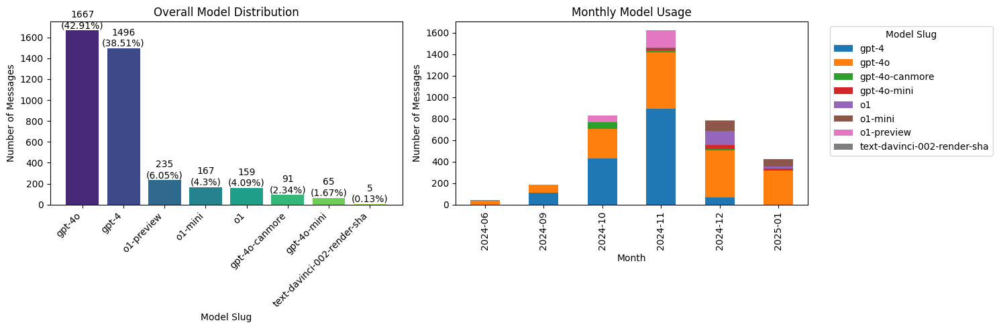

This visualization presents a comprehensive view of chat message patterns and general usage:

General Usage Patterns:
- The plot shows the total number of messages sent over time
- A clear distinction between weekday and weekend usage is visible
- The baseline activity shows consistent daily chat interactions
- Regular fluctuations indicate daily active user patterns

Academic Period Impact:
- Significant spikes in activity correlate with exam periods
- Higher message frequency during weekdays compared to weekends
- Notable increase in usage during academic term times
- Lower activity during holiday periods and semester breaks

Message Distribution Characteristics:
- Peak usage times show concentrated bursts of activity
- The trend line reveals both short-term and long-term usage patterns
- Message frequency varies with academic calendar events
- Distinct patterns emerge for different times of day

This analysis suggests that while exam periods do influence usage patterns, there's a consistent baseline of chat activity that follows regular daily and weekly cycles, indicating that the AI chat system serves both academic and general purposes.

### 2. Hourly Usage Distribution
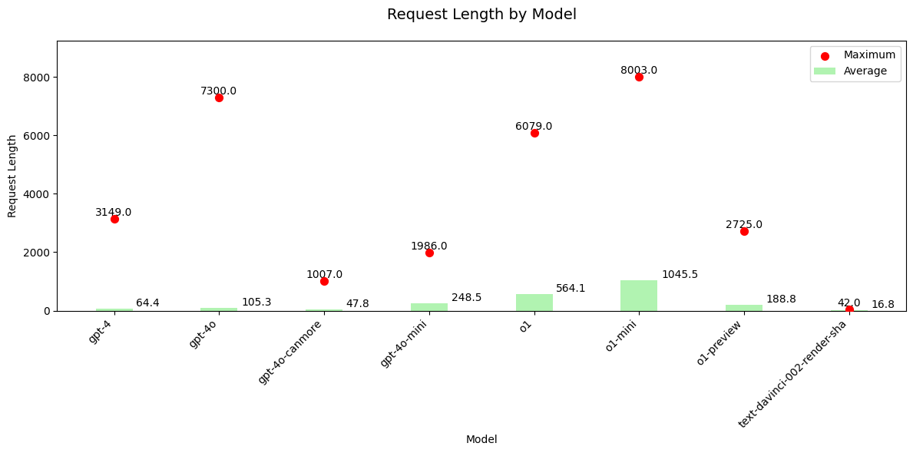
*Distribution of chat interactions by hour*

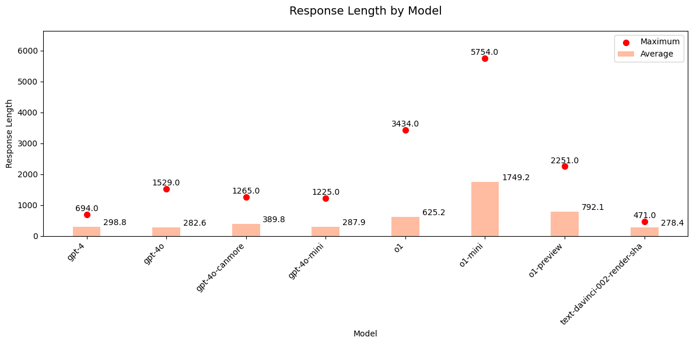
*Daily chat interaction patterns*

### Emotional Content Analysis
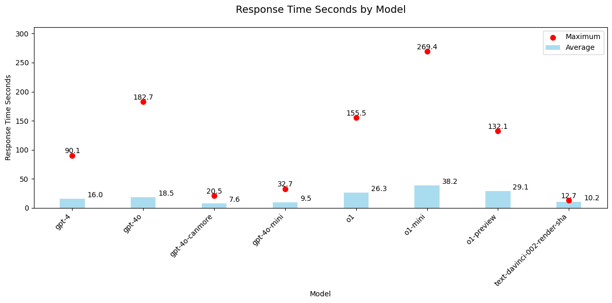
*Distribution of emotional content in chats*

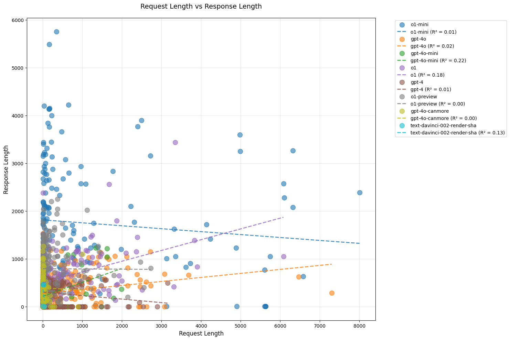
*Trends in emotional expressions over time*

### Usage Patterns
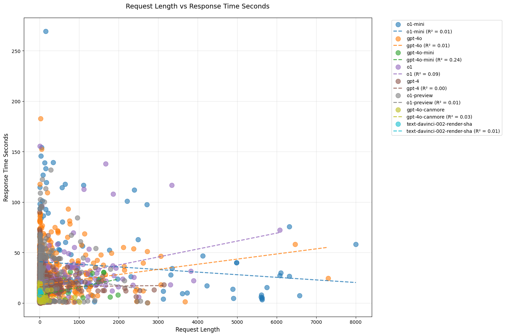
*Detailed usage pattern analysis - Part 1*

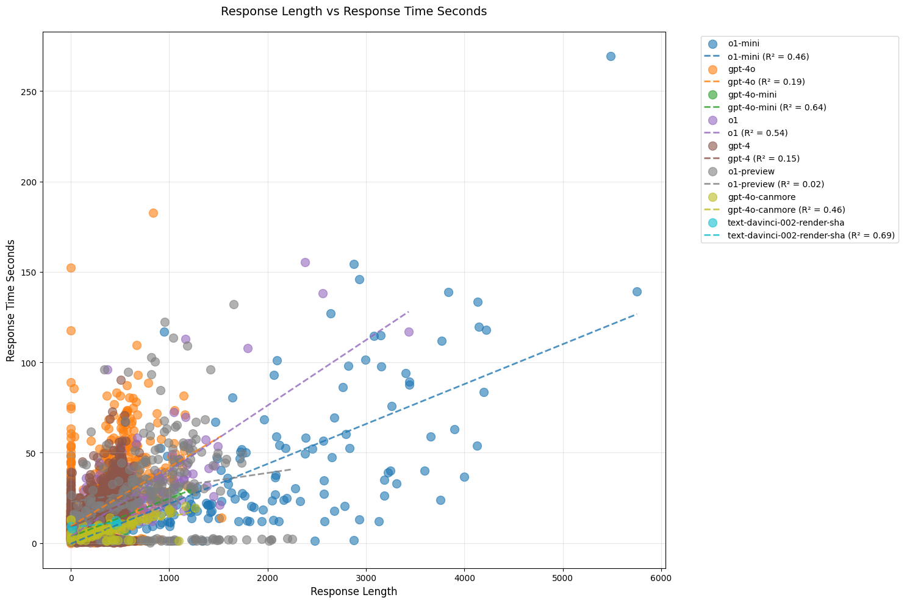
*Detailed usage pattern analysis - Part 2*

### Temporal Analysis
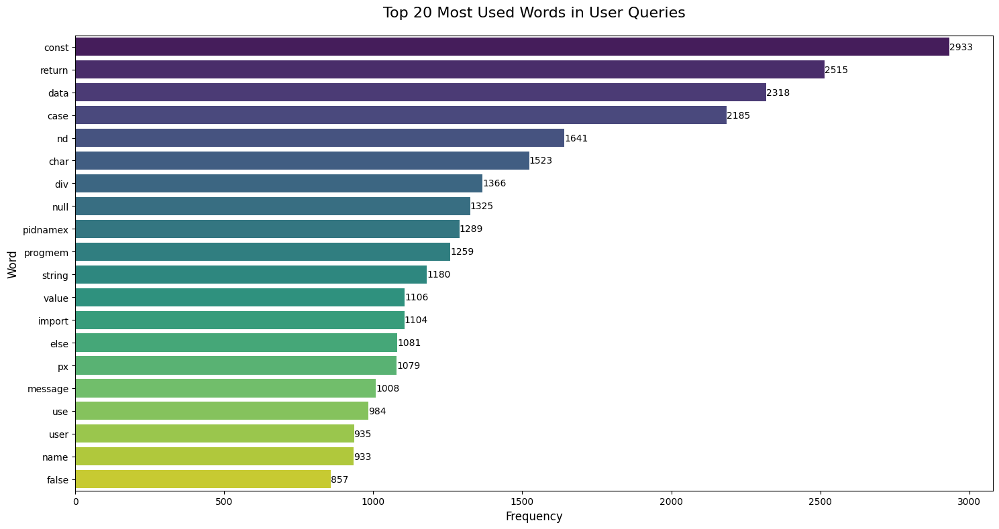
*Temporal analysis of chat interactions - Part 1*

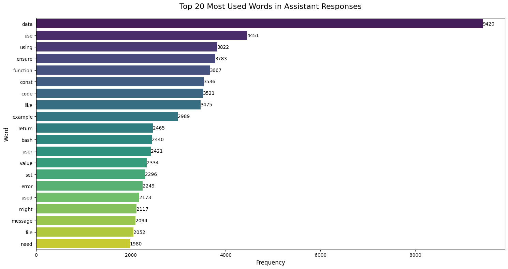
*Temporal analysis of chat interactions - Part 2*

### Additional Insights
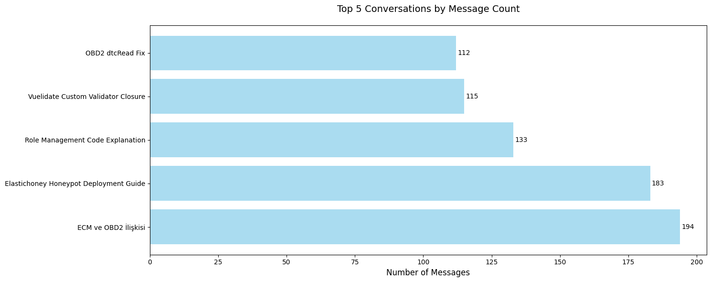
*Additional analytical insights - Part 1*

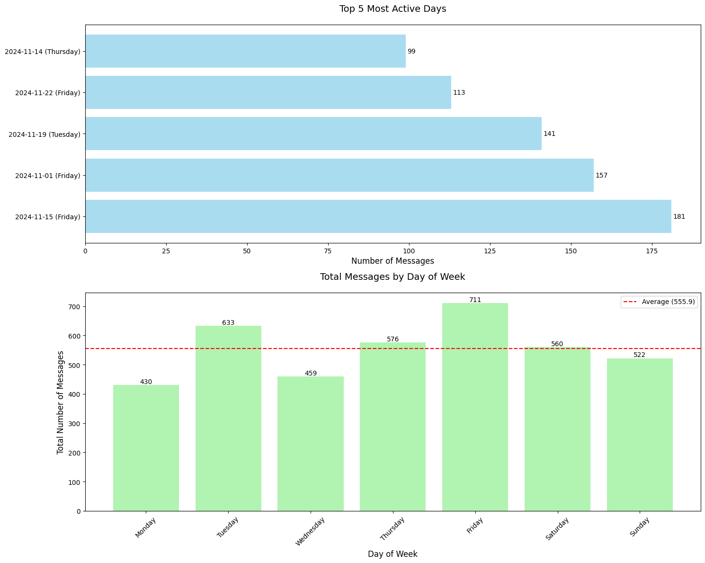
*Additional analytical insights - Part 2*

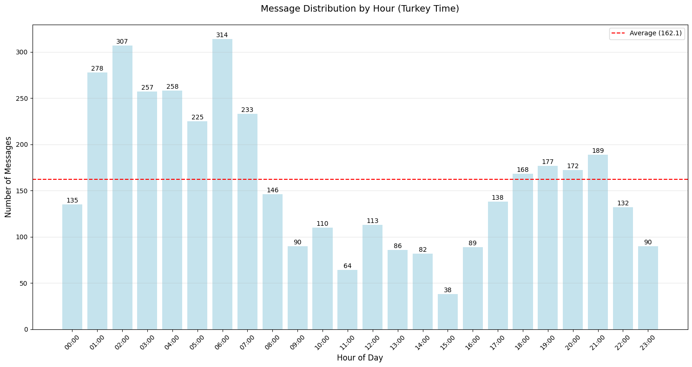
*Additional analytical insights - Part 3*

### Final Observations
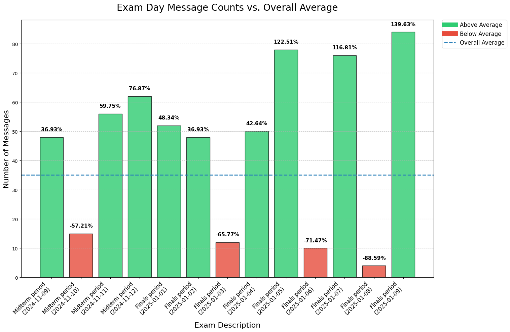
*Final analytical observations - Part 1*

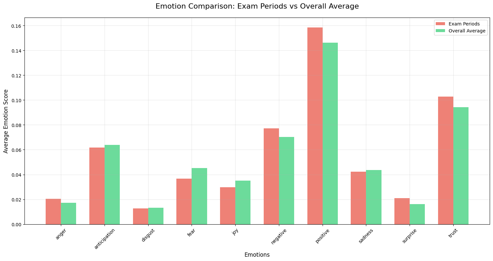
*Final analytical observations - Part 2*

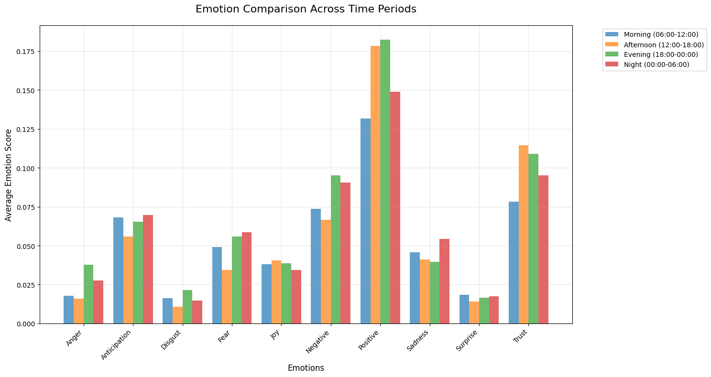
*Final analytical observations - Part 3*

## Key Findings
1. There are distinct patterns in AI chat usage during exam periods
2. Emotional content varies significantly based on time of day
3. Usage patterns show clear temporal trends
4. Specific hours show higher engagement rates

## Tools and Technologies
- Python for data analysis
- Jupyter Notebook for interactive analysis
- Data visualization libraries (matplotlib, seaborn)
- Statistical analysis tools

## Repository Structure
```
.
├── generative-ai_usage_analysis.ipynb  # Main analysis notebook
├── images/                            # Visualization outputs
│   └── *.png                         # Analysis visualizations
├── README.md                         # Project documentation
└── example.json                      # Example data file
``` 