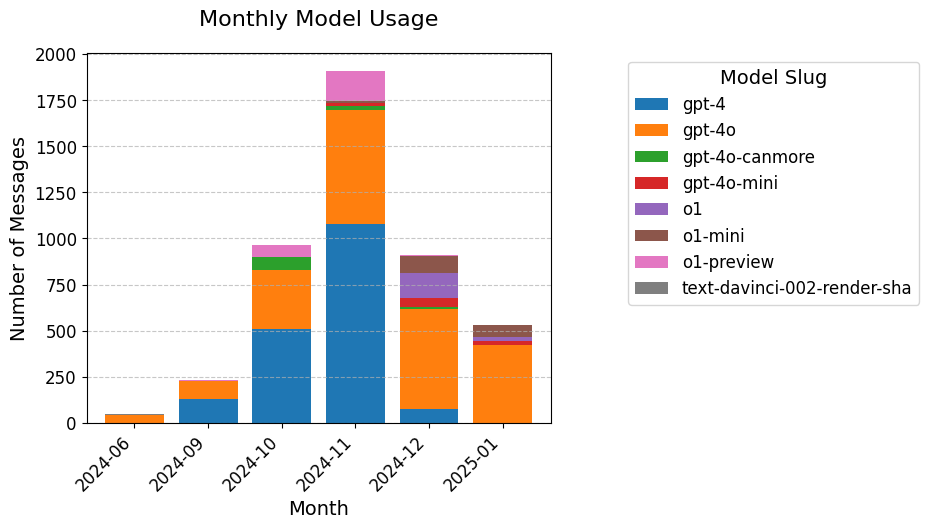

# Generative AI Usage Analysis

## Motivation
As an active user of generative AI tools, I wanted to understand my own interaction patterns and behaviors with these systems. This project stems from my curiosity about how I utilize AI assistance throughout different times of the day, particularly during academic pressure points like exam periods. Understanding these patterns could help optimize my use of AI tools and provide insights into my learning and problem-solving approaches.

## Data Source
The data was collected through my personal ChatGPT usage over several months. Using ChatGPT's data export feature, I obtained my conversation history in JSON format, which included:
- Timestamps of all interactions
- Message contents (both queries and responses)
- Model types used (GPT-4, GPT-4o, O1, etc.)
- Request and response lengths
- Processing times
- Conversation contexts

## Hypothesis
Alternative Hypothesis (H₁):
Exam periods and certain hours of the day have a significant impact on the emotional content and interaction patterns with generative AI.

Null Hypothesis (H₀):
Exam periods and certain hours of the day do not have a significant impact on the emotional content and interaction patterns with generative AI.

## Data Analysis
### 1. Model Type Usage Analysis

This chart presents the distribution of messages across different models. The GPT-4 model has the highest number of messages, accounting for 44.45% of the total, followed by GPT-4 at 38.93%. Other models, including O1-preview, O1-mini, and GPT-4-cannonmore, represent smaller proportions of the total message count. The chart provides a visual representation of how the messages are distributed across various model slugs, highlighting the prominence of GPT-4 models in comparison to others.

### 2. Monthly Usage Distribution

The chart displays the average and maximum request lengths for different models.

it reveals a shift in model usage trends. The usage of GPT-4 (blue) appears to have peaked and is now on the decline, with GPT-4o (orange) becoming the preferred model, especially from November 2024 onwards. Additionally, the O1 models (purple and brown) have gained traction, indicating a growing preference for these over time. This suggests that the trend for GPT-4 is over, with GPT-4o and the O1 models now taking the lead in usage.

### 3. Model Request Length Analysis

The chart displays the average and maximum request lengths for different models.

it reveals that the O1 and O1-mini models have significantly larger average request lengths compared to others. This suggests that these models are typically queried with much more extensive input, likely indicating tasks such as processing long PDFs, code summaries, or other large content. In contrast, models like GPT-4 and GPT-4o-canmore have much smaller request lengths, implying they handle more concise queries on average. The larger request lengths for O1 models likely reflect their use in more complex or detailed processing tasks.

### 4. Model Response Length Analysis

The chart displays the average and maximum response lengths for different models.

O1 and O1-mini lead in both average and maximum response lengths. The O1 model has an average response length of 625.2 and a maximum of 3434.0, while the O1-mini model has an average of 1749.2 and a maximum of 5754.0. These models stand out for handling significantly larger responses.

### 5. Model Response Time Length Analysis

O1 and O1-mini models show the highest response times, with O1-mini reaching an average of 38.2 seconds and a maximum of 269.4 seconds. The O1 model follows closely with an average of 26.3 seconds and a maximum of 155.5 seconds.

### 6. Request Length vs Response Length Analysis

This scatter plot attempts to analyze the relationship between request length and response length across different models. However, the plot shows that there is no significant correlation between the two variables for most models. While a few models like O1-mini and GPT-4o-mini show a very weak positive correlation, the overall trend indicates that the response length does not strongly depend on the request length. Most models, including GPT-4, O1-preview, and GPT-4o-canmore, exhibit near-zero correlations, suggesting that request length and response length are largely independent of each other.

### 7. Request Length vs Response Time Analysis

This scatter plot attempts to analyze the relationship between request length and response time in seconds across various models. Each point represents a single query, with its position determined by the request length on the x-axis and the response time on the y-axis. The trend lines for each model are shown, but the analysis reveals no significant correlation between the two variables. 

### 8. Top 20 Most Used Words in User Queries

This scatter plot shows the relationship between response length and response time seconds for various models, with trend lines indicating the degree of correlation.
The scatter plot indicates that there is a positive correlation between response length and response time for most models, except for GPT-4o, GPT-4, and O1-preview. These three models show weak or negligible correlations, with R² values of 0.01, 0.15, and 0.02, respectively.

For all other models, including Text-davinci-002-render-sha, GPT-4o-mini, O1-mini, and GPT-4o-canmore, a noticeable positive correlation exists, meaning that as the response length increases, the response time generally increases as well. Models like Text-davinci-002-render-sha and GPT-4o-mini exhibit stronger correlations, indicating that larger responses tend to take longer to process.

### 9. Top 20 Most Used Words in User Queries

It seems that ChatGPT has been used primarily for code-related queries, as shown by the frequent appearance of programming terms like "const", "return", "data", and "case". These terms are commonly used in coding contexts, suggesting that most queries are focused on coding assistance. Additionally, words such as "null", "string", "import", and "px" further reinforce this idea, as they are related to programming constructs and styling in code. The inclusion of terms like "user", "message", and "name" also points to interactions within a coding or software development environment.

### 10. Top 20 Most Used Words in Assistant Responses

From the most frequently used words in the assistant's responses, it's clear that the majority of explanations revolve around code-related terms. Words like "data", "use", "ensure", "function", and "const" appear prominently, showing that a significant portion of the responses includes explanations and examples related to coding concepts. Additionally, terms like "code", "example", "return", and "set" further highlight that code examples are commonly provided alongside the explanations. This suggests that the assistant frequently provides coding solutions or clarifications with accompanying code samples.

### 11. Top 5 Conversations by Message Count

These topics represent the projects I’m currently focused on, which naturally have the highest number of messages due to the complexity and time spent working through these challenges.

### 12. Activity Analysis by Day

It’s clear that I tend to use ChatGPT more frequently on Fridays, as three of the top five most active days fall on a Friday (2024-11-01, 2024-11-15, and 2024-11-22). Additionally, Friday has the highest total message count overall, with 711 messages, significantly above the average of 555.9 messages per day. This pattern highlights that Fridays are my most active days for engaging with ChatGPT

### 13. Message Distribution by Hour

It seems that I work extensively at night, as the highest message counts occur during late-night and early-morning hours, particularly around 07:00 (314 messages) and 06:00 (307 messages). Additionally, there’s another notable peak in activity during the evening, with 21:00 (189 messages) being the most active hour in the evening. This pattern indicates a tendency to focus on tasks late at night and during early mornings, likely dedicating these hours to more concentrated work or projects.

### 14. Exam Period Message Activity Analysis

This chart illustrates message activity during exam periods compared to the overall average. During midterm and final periods, message counts were generally above average on several days, indicating increased activity likely driven by exam preparation or related queries. For instance, certain days during these periods, like January 1st and January 5th, saw message counts exceed the overall average by significant percentages, with peaks of 122.51% and 139.63%. Conversely, some days, such as January 3rd and January 8th, experienced below-average activity, showing a reduction in messages by as much as 65.77% and 88.59%. The fluctuations suggest a focus on using ChatGPT heavily before exams and tapering off during or immediately after them, reflecting the changing priorities and time constraints during these periods.

### 15. Emotion Analysis During Exam Periods vs Overall Average

Using NRC Emotion Analysis, the emotions in the messages were evaluated and compared during exam periods against the overall average. NRC Emotion Analysis is a framework that categorizes text into eight basic emotions—anger, anticipation, disgust, fear, joy, sadness, surprise, and trust—along with two overarching sentiments: positive and negative. This allows us to understand the emotional tone embedded in the messages. The lack of a noticeable emotional change suggests that the interaction with the assistant during exams does not carry an additional emotional load compared to regular interactions. This may indicate that the queries are primarily functional and focused on problem-solving, regardless of the external context, such as exam-related stress. Overall, the emotional landscape remains stable, highlighting that the messages are more task-oriented than emotionally driven.

### 16. Emotion Comparison Across Time Periods

Again, Using NRC Emotion Analysis, emotions were evaluated across four time periods—morning (06:00–12:00), afternoon (12:00–18:00), evening (18:00–00:00), and night (00:00–06:00). While slight differences can be observed in the average emotion scores, there is no strong correlation between time periods and emotional expression.
For instance, positive and trust emotions are consistently dominant across all time periods, with minor variations. The evening and afternoon periods show slightly higher scores for these emotions, but the differences are not significant enough to suggest a meaningful trend. Similarly, anticipation scores remain relatively stable across the day, indicating consistent forward-looking interactions regardless of the time.
Emotions like anger, fear, and disgust remain consistently low across all time periods, showing no significant spikes or dips. This suggests that interactions are largely task-focused and not emotionally charged, irrespective of the time of day.
Even negative emotions, such as sadness and negative sentiment, exhibit negligible variation throughout the day, reinforcing the conclusion that emotional patterns remain consistent regardless of when interactions occur.
In summary, while there are slight fluctuations in the data, no meaningful correlation exists between the time of day and the emotional tone of the messages. The emotional landscape remains stable and consistent, indicating that usage patterns are driven more by functionality than emotional factors.

## Findings

The analysis conducted on my generative AI usage data led to several key insights:

Rejection of the Null Hypothesis: The initial hypothesis posited that exam periods and specific hours of the day impact the emotional content and interaction patterns with generative AI. However, the findings indicate that there is no substantial correlation between these factors. Emotion analysis during exam periods revealed that the emotional tone of interactions remains consistent with the overall average, suggesting that the stress or pressure of exam periods does not significantly alter the nature of my interactions with ChatGPT. Similarly, emotional analysis across different times of the day showed stable emotional patterns, regardless of whether interactions occurred in the morning, afternoon, evening, or night. Therefore, the null hypothesis is rejected, as the expected significant correlations were not observed.

Predominant Use for Coding: The word frequency analysis highlighted that the majority of user queries and assistant responses are centered around coding-related terms. Words such as "const," "return," "data," "function," and "import" frequently appeared in both user queries and assistant responses. This strong emphasis on programming terminology indicates that ChatGPT is primarily utilized for coding assistance, including tasks like debugging, code generation, and understanding programming concepts. This specialization suggests that generative AI tools are integral to my software development workflow, providing valuable support in coding and related activities.

## Future work Limitations
While this analysis provides valuable insights into my usage patterns and behaviors with generative AI tools, there are several limitations and avenues for future work to enhance understanding and address existing gaps:

Enhanced Natural Language Processing (NLP) Techniques: The current analysis employed basic NLP methods for emotion detection and word frequency analysis. Incorporating more advanced NLP techniques, such as contextual sentiment analysis and topic modeling, could provide a deeper understanding of the nuances in interactions. This would allow for a more granular analysis of the content and intent behind user queries and assistant responses.

Expanded Sentiment Analysis Frameworks: Utilizing a broader range of sentiment analysis frameworks beyond NRC Emotion Analysis could capture a more diverse set of emotional nuances. Exploring models that account for mixed emotions or contextual sentiment shifts would enhance the accuracy and depth of emotional insights.